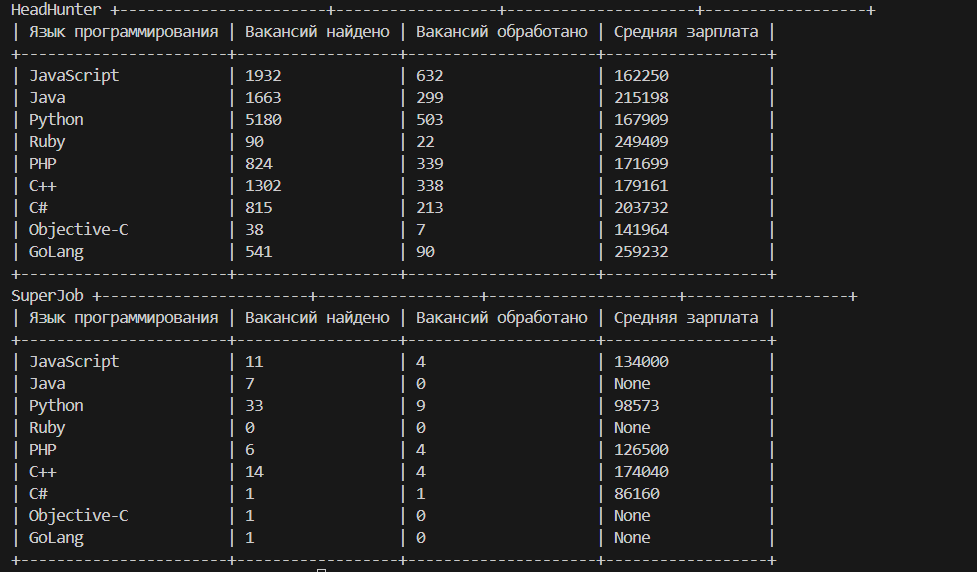

# Описание

Данный скрипт создан для того, чтобы находить среднюю зарплату по вакансиям программиста с двух сервисов (HeadHunter и SuperJob) по разным языкам программирования.

# Установка 

Чтобы скачать каталог с данным проектом на ваше устройство **с системой Linux** будет достаточно выполнить следующую команду:  

```bash
git clone https://github.com/Nick536363/Lesson_5-API
```

Если ваша операционная система - **Windows**, то вам стоит поискать кнопку скачивания на самом *Github*.

*Python3* уже должен быть установлен на вашем устройстве. Если вы еще не установили его - посетите страницу по [данному адресу](https://python.org)

Чтобы запустить код вам потребуеться установить зависимости следющим образом:

```bash
pip install -r requirements.txt
```

# Переменные окружения

В данном коде фигурирует лишь одна переменная окружения с название ***SUPERJOB_API_KEY***, созданная с целью хранить ваш API-ключ сервиса SuperJob. Нужен он с целью отправки запросов на сам сервис и получения соотвествующей информации. Если у вас нету своего API-ключа, то можете получить его посетив [эту страницу](https://api.superjob.ru/)

# Функции скрипта и их аргументы

## Вакансии сервиса HeadHunter

Функция по получение информации вакансий с сервиса HeadHunter принимает лишь 2 аргумента:
- Язык программирования (или текст поиска)
- Номер страницы

Первый из аргументов хранит в себе название языка программирования по которому будут найдены вакансии с зарплатой.

Второй же содержит номер страницы, на которой находяться вакансии.

### Искуственная задержка работы функции

В связи с установленной капчей сотрудниками сервиса HeadHunter, при отправке запросов без задержки будет вызвана ошибка 403 (доступ запрещен) на каком-то из запросов. Чтобы не было таких неприятностей разработчик специально замедлил скрипт, с целью полной работоспособности скрипта.

## Вакансии сервиса SuperJob

Функция которая ищет информацию по вакансиям с SuperJob'a принимает 3 следующих аргумента:  
- Язык программирования (либо также текст поиска) 
- Номер страницы
- API-ключ сервиса SuperJob

Первые два аргумент принимает такие же значение как и в HeadHunter'е - **первый** содержит название языка программирования по которому будут найдены вакансии, а **второй** номер страницы на которой будут просматриваться вакансии.

В то время как **третий аргумент** принимает ваш API-ключ с сервиса SuperJob с помощью которого буду осуществлены все запросы на сам сервис.

Важно подметить что значение API-ключа **должно** находиться в файле расширения **.env** в том же каталоге что и скрипт, так как это единственный способ использования вашего API-ключа в данном скрипте.

## Подсчёт средней зарплаты

Функция принимает 2 аргумента:
- Зарплата от
- Зарплата до

Вне зависимости от того, указан ли только один аргумент или оба - функция в любом случае вернет среднюю зарплату. Только если в случае не указан ни один аргумент функция вернет None (не вернет число).

> ### Правила в работе этой функции такие:
> - Если указаны оба аргумента - то функция подсчитывает среднюю арифмитическую этих двух чисел.
> - При указаннии только аргумента *Зарплата от*, функция вернет значение этого аргумента умноженного на 0.8
> - В случае если указан только аргумент *Зарплата до*, функция умножит значение аргумента на 1.2 и вернет полученное значение
> - Если ни один из аргументов не указана, функция ничего не вернет  


# Запуск 

Чтобы запустить проект будет достаточно выполнить следующую команду в терминале  
```bash
python main.py
```  

После запуска подождите немного, после чего получите красиво оформленную таблицу со всей информацией.  

